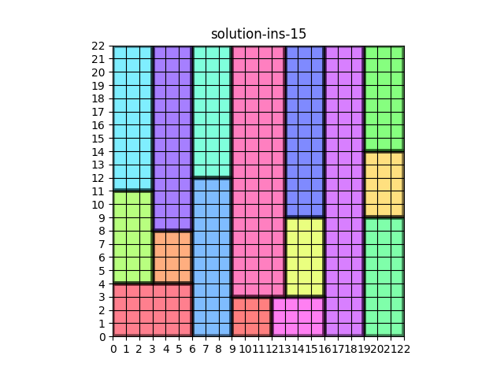
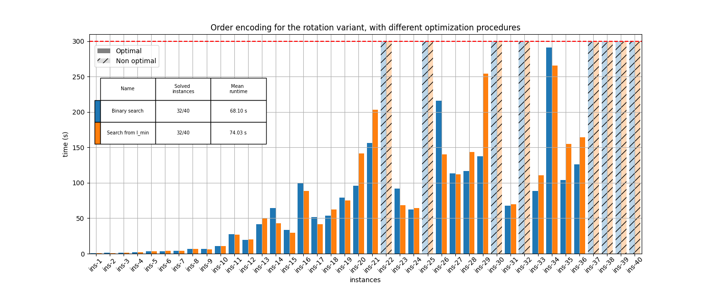

# :iphone: Very Large Scale Integration (VLSI) Optimization 🧩
*VLSI (Very Large Scale Integration)* refers to the trend of integrating circuits into silicon chips. A typical example is the smartphone. The modern trend of shrinking transistor sizes, allowing engineers to fit more and more transistors into the same area of silicon, has pushed the integration of more and more functions of cellphone circuitry into a single silicon die (i.e. plate).

The VLSI problem taken into account is the following: given a fixed-width plate and a list of rectangular circuits, the arrangement of the circuits must be decided in order to minimize the length of the plate.

Two variants of the problem are considered. In the first, each circuit must be placed in a fixed orientation with respect to the others. This means that, an $n \times m$ circuit cannot be positioned as an $m \times n$ circuit in the silicon plate. In literature, this problem is known as *Two-dimensional Strip Packing Problem (2SPP)*. 

In the second case, the rotation is allowed, which means that an $n \times m$ circuit can be positioned either as it is or as $m \times n$.

This problem has been tackled using four different combinatorial optimization approaches, namely:
* **Constraint Programming (CP)**
* **Boolean Satisfiability (SAT)**
* **Satisfiability Modulo Theory (SMT)**
* **Linear Programming (LP)**

A total of $40$ instances have been provided for testing purposes, setting a time limit of $300$ seconds.

## Description
The directory `src/scripts` contains the scripts of the project that the user directly interacts with. There are three main groups of scripts:
* **Execute**: `execute_cp.py`; `execute_lp.py`; `execute_sat.py`; `execute_smt.py`. They run the specified model, of the selected approach (*CP*, *LP*, *SAT* or *SMT*), for solving the specified VLSI problem instance. The following is an example of a solved instance.

  

* **Compare models**: `compare_cp_models.py`; `compare_lp_models.py`; `compare_sat_encodings.py`; `compare_smt_encodings.py`. They compare the specified model,  of the selected approach, on solving the specified VLSI problem instances. The following is an example of a comparison plot.

  

* **Solve all instances**: `solve_all_instances_cp.py`; `solve_all_instances_lp.py`; `solve_all_instances_sat.py`; `solve_all_instances_smt.py`. They solve the set of all the available instances using the best model of the selected approach.

### Models
In the folder `src/*`, where `*` refers to either `cp`, `lp`, `sat` or `smt`, the models related to the specific approach can be found.

### Instances
In the folder `instances` the `.txt` representation of the $40$ instances of the problem is present.

An instance of VLSI is a text file consisting of lines of integer values. The first line gives $w$, which is the width of the silicon plate.
The following line gives $n$, which is the number of necessary circuits to place inside the plate. Then $n$ lines follow, each with $w_i$ and $h_i$, representing the horizontal and vertical dimensions of the $i$-th circuit. 

For example, a file
with the following lines:
* $9$
* $5$
* $3 \ 3$
* $2 \ 4$
* $2 \ 8$
* $3 \ 9$
* $4 \ 12$

describes an instance in which the silicon plate has the width $9$, and we need to place $5$ circuits, with the dimensions $3 \times 3$, $2 \times 4$, $2 \times 8$, $3 \times 9$, and $4 \times 12$.

### Solutions
In the folder `solutions` the `.txt` representation of the solutions of the $40$ instances of the problem is present.

An solution of a VLSI instance is a text file consisting of lines of integer values. The first line gives $w$ and $l$, which are the width and the legth of the silicon plate respectively.
The following line gives $n$, which is the number of necessary circuits to place inside the plate. Then $n$ lines follow, each with $w_i$, $h_i$, $x_i$, $y_i$, representing respectively the horizontal and vertical dimensions of the $i$-th circuit and its bottom-left coordinates. 

For example, a file with the following lines:
* $9 \ 12$
* $5$
* $3 \ 3 \ 4 \ 0$
* $2 \ 4 \ 7 \ 0$
* $2 \ 8 \ 7 \ 4$
* $3 \ 9 \ 4 \ 3$
* $4 \ 12 \ 0 \ 0$

says thet for the given instance that the left-bottom corner of the $3 × 3$ circuit is at $(4, 0)$ etc.

### Visualization
By default, the `execute_*.py` scripts create a graphical representation of the solution. This is achieved thanks to the auxiliary `visualize.py` script.

By default, the scripts of the *compare models* group create a comparison plot. of the solution. This is achieved thanks to the auxiliary `plot_comparisons.py` script.

## Usage

## Installation

## Interfaces

### Execute models
The `execute_*.py` scripts all present the following positional arguments:
* `model`: The model to execute (`encoding` for *SAT* and *SMt*)
* `instance`: The instance to solve

And the following optional parameters:
* `output-folder-path`: The path in which the output file is stored
* `output-name`: The name of the output solution
* `--time-limit`: The allowed time to solve the task in seconds
* `--no-create-output`: Skip the creation of the output solution
* `--no-visualize-output`: Skip the visualization of the output solution (defaults as true if `--no-create-output` is passed).

Moreover `execute_lp.py` presents the following parameters:
* `solver`: The solver used for optimization
* `--use-symmetry`: Break symmetries in the presolve process.
* `--use-dual`: Use the dual model.
* `--use-no-presolve`: Avoid AMPL presolving process.

Finally, `execute_smt.py` presents the following parameter:
* `solver`: The solver used for optimization.

### Compare models

## Repository structure

    .
    ├── images                              # Plots of the performances of different models for the different approaches
    │   ├── cp
    │   ├── lp
    │   ├── sat
    │   └── smt
    ├── instances                           
    │   ⋮
    │   └── ins-*-.txt                      # Instances to solve in `.txt` format
    ├── report
    ├── results                             # Json results of the performances of different models for the given approaches
    │   ├── cp
    │   ├── lp
    │   ├── sat
    │   └── smt
    ├── solutions                           # Solutions for the given instances using different approaches
    │   ├── cp
    │   ├── cp-rotation
    │   ├── lp 
    │   ├── lp-rotation
    │   ├── sat
    │   ├── sat-rotation
    │   ├── smt
    │   └── smt-rotation
    ├── src
    │   ├── cp                      
    │   │   ├── data                        # Directory containing data examples for the problem in CP
    │   │   ├── models                      # Directory containing the models solving the problem in CP
    │   │   ├── rotation_models             # Directory containing the models solving the problem in CP considering rotations
    │   │   ├── solvers                     # Directory containing the solver configurations for CP
    │   │   └── project_cp.mzp              # MiniZinc CP project
    │   ├── lp
    │   │   ⋮
    │   │   └── model_*.mod                 # AMPL model solving the problem in LP
    │   ├── sat
    │   │   ⋮
    │   │   ├── encoding_*.py               # Encoding solving the problem in LP
    │   │   └── sat_utils.py                # Script containing useful functions for SAT
    │   ├── scripts                      
    │   │   ├── compare_cp_models.py        # Script to compare the results of CP models on the instances
    │   │   ├── compare_lp_models.py        # Script to compare the results of LP models on the instances
    │   │   ├── compare_sat_encodings.py    # Script to compare the results of SAT encodings on the instances
    │   │   ├── compare_smt_encodings.py    # Script to compare the results of SMT encodings on the instances
    │   │   ├── execute_cp.py               # Script to solve an instance using CP
    │   │   ├── execute_lp.py               # Script to solve an instance using LP
    │   │   ├── execute_sat.py              # Script to solve an instance using SAT
    │   │   ├── execute_smt.py              # Script to solve an instance using SMT
    │   │   ├── plot_comparisons.py         # Script to plot the results of the use of different models on the instances
    │   │   ├── position_and_covering.py    # Script applying the Position and Covering technique for LP
    │   │   ├── solve_all_instances_cp.py   # Script solving all instances with CP
    │   │   ├── solve_all_instances_lp.py   # Script solving all instances with LP
    │   │   ├── solve_all_instances_sat.py  # Script solving all instances with SAT
    │   │   ├── solve_all_instances_smt.py  # Script solving all instances with SMT
    │   │   ├── solve_all_instances.py      # Script solving all instances with a desired methodology
    │   │   ├── unify_jsons.py
    │   │   ├── utils.py                    # Script containing useful functions
    │   │   └── visualize.py                # Script to visualize a solved instance
    │   └── smt
    │       ├── solvers                     # Directory containing the solvers executable files for SMT
    │       │   ⋮
    │       ├── encoding_*.py               # Encoding solving the problem in SMT
    │       └── smt_utils.py                # Script containing useful functions for SMT
    ├── .gitattributes
    ├── .gitignore
    ├── LICENSE
    └── README.md

## Versioning

Git is used for versioning.

## Group members

|  Name           |  Surname  |     Email                           |    Username                                             |
| :-------------: | :-------: | :---------------------------------: | :-----------------------------------------------------: |
| Antonio         | Politano  | `antonio.politano2@studio.unibo.it` | [_S1082351_](https://github.com/S1082351)               |
| Enrico          | Pittini   | `enrico.pittini@studio.unibo.it`    | [_EnricoPittini_](https://github.com/EnricoPittini)     |
| Riccardo        | Spolaor   | `riccardo.spolaor@studio.unibo.it`  | [_RiccardoSpolaor_](https://github.com/RiccardoSpolaor) |

## License

This project is licensed under the MIT License - see the [LICENSE](LICENSE) file for details.

